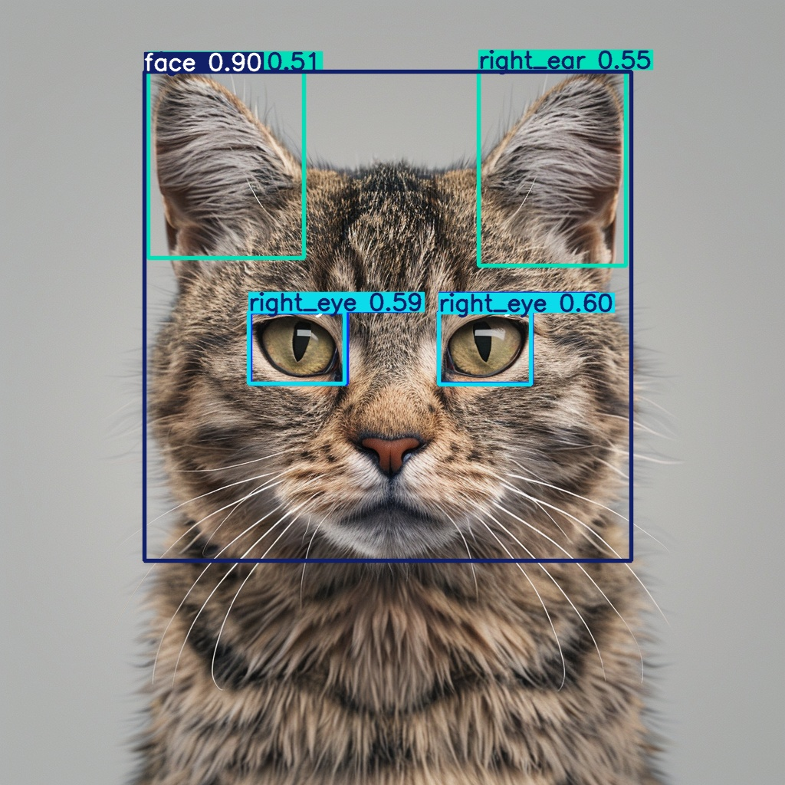
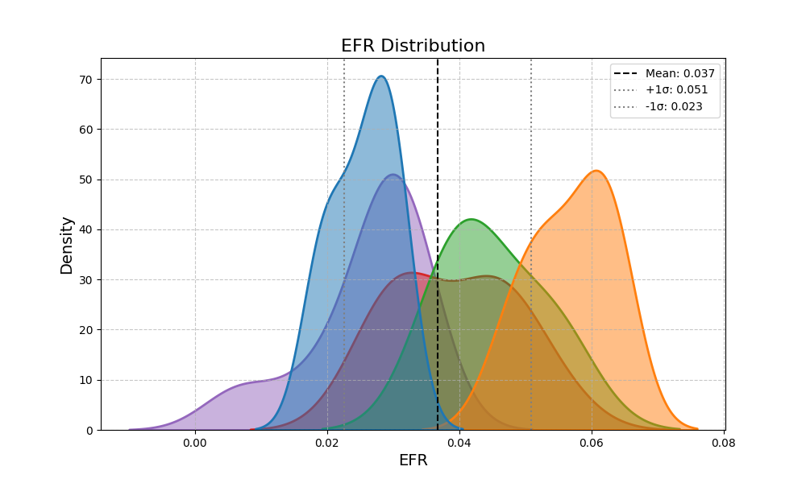
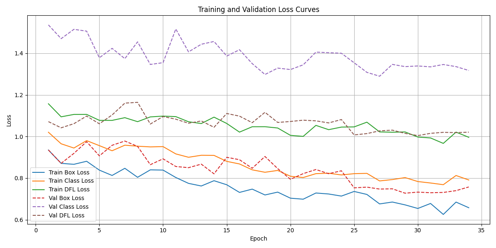

#  Animal Facial Feature Analysis  
### **YOLOv8 · Feature Engineering · Statistical Visualization**  
A Complete AI Pipeline for Multispecies Facial Structure Analysis
*(Author: Lizzie — Data Science & Multimodal Perception)*

---
<p align="center">  </p>

##  Overview  

This repository provides a fully reproducible end-to-end AI pipeline for analyzing structural patterns in animal faces.
The workflow covers:

### Computer Vision Engineering

YOLOv8 model training for animal facial landmark detection

Left–right flip disabled to preserve asymmetric eye/ear structure

Batch inference for multiple species:

🐱 Cat

🐶 Dog

🦊 Fox

🐻 Bear

🐹 Hamster

###  Geometric Feature Engineering
The pipeline extracts detailed geometric indicators, including:

EFR — Eye-to-Face Ratio

ESI — Eye Shape Index

fWHR — Facial Width-to-Height Ratio

Eye Symmetry Difference (%)

Ear Uprightness (left / right / average)

These features enable both biological morphology research and perception-based analysis.

### Statistical Visualization

The project generates:

KDE density distributions

Histograms

Feature comparison across species

YOLOv8 training diagnostics:

Loss curves

mAP curves

PR / F1 curves

Confusion matrix

### Research-Oriented Workflow
Designed for scientific and engineering use cases:

Cross-species facial structure comparison

Morphological / perceptual studies

Model validation & dataset exploration

Reproducible experiments for publications

---

## Project Structure
```
animal-feature-analysis/
├── README.md
├── LICENSE
├── .gitignore
│
├── data/
│   └──  animal_features_extracted_sample.csv   # Extracted geometric features
│
├── results/
│   ├── batch_inference_output/               # YOLOv8 annotated output images
│   │     ├── cat4.jpg
│   │     ├── dog4.jpg
│   │     ├── fox14.jpg
│   │     └── ... (multiple species)
│   │
│   └── feature_distribution_plots/           # KDE, histogram, multi-feature plots
│   │     ├── EFR_advanced_distribution.png
│   │     ├── ESI_advanced_distribution.png
│   │     ├── fWHR_advanced_distribution.png
│   │     └── avg_ear_uprightness_deg_advanced_distribution.png
│   │
│   └──  training_plots/                       # YOLOv8 training diagnostics
│         ├── loss_curve.png
│         ├── map_curve.png
│         ├── P_curve.png
│         ├── R_curve.png
│         ├── PR_curve.png
│         ├── F1_curve.png
│         ├── confusion_matrix.png
│         ├── confusion_matrix_normalized.png
│         ├── labels.jpg
│         ├── labels_correlogram.jpg
│         ├── train_batch0.jpg
│         └── val_batch1_pred.jpg
├── src/
│   ├── feature_extraction/
│   │   ├── extract_animal_features.py      # Compute EFR / ESI / fWHR / ear angle etc.
│   │   └── create_data_yaml.py             # Helper for YOLO data.yaml creation
│   │
│   ├── visualization/
│   │     ├── plot_feature_distributions.py   # KDE & multi-feature visualizations
│   │     ├── plot_fWHR_histogram.py
│   │     └── plot_training_log.py            # Parse YOLO results.csv
│   │
│   ├── inference/
│   │   └── batch_inference.py              # Apply YOLO model to test_images/
│   │
│   └── training/
│       └── train_yolov8_noflip.py          # YOLOv8 training (LR flip disabled)
│   
└── test_images/                        # Sample raw images for inference
      ├── cat10.png
      ├── dog22.png
      ├── bear2.png
      ├── hamster1.png
      └── ...
```

## Example Outputs
## 1. YOLOv8 Detection Result

<p align="center">  </p>

## 2. Feature Distribution Visualization (KDE)
<p align="center">  </p>

## 3.YOLOv8 Training Curves (Loss Curve Example)
<p align="center">  </p>

## How to Use
## 1. Train YOLOv8 (No Flip Augmentation)
(Left-right flip disabled to avoid corrupting asymmetric facial landmarks)
```bash
python src/training/train_yolov8_noflip.py

```

## 2. Run Batch Inference on Sample Images
```bash
python src/inference/batch_inference.py
```
Outputs saved to:
```bash
results/batch_inference_output/

```

## 3. Extract Geometric Facial Features

```bash
python src/feature_extraction/extract_animal_features.py

```
Output:
```bash
data/animal_features_extracted_sample.csv
```

## 4. Visualize Feature Distributions
KDE + Per-species distributions:
```bash
python src/visualization/plot_feature_distributions.py
```
fWHR Histogram:
```bash
python src/visualization/plot_fWHR_histogram.py
```
YOLO Training Log (Loss / mAP / Confusion Matrix)
```bash
python src/visualization/plot_training_log.py
```
Output:
```bash
results/feature_distribution_plots/
results/training_plots/
```

---
## Technologies Used

**Programming**

Python

NumPy / pandas

Matplotlib / seaborn

**Computer Vision**

YOLOv8 model training & inference

Custom augmentation strategy (no left-right flip)

Multi-species landmark detection

**Data Science & Feature Engineering**

fWHR, EFR, ESI, ear/uprightness, symmetry difference

Data normalization / aggregation

KDE + histogram + multi-feature comparison

Training diagnostic visualization

**Pipeline Design**

Modular codebase (src/ structure)

Reproducible workflow

Clean separation between training / inference / feature extraction / visualization

Suitable for research, portfolio, and scientific analysis


---
Author

Lizzie Qing

